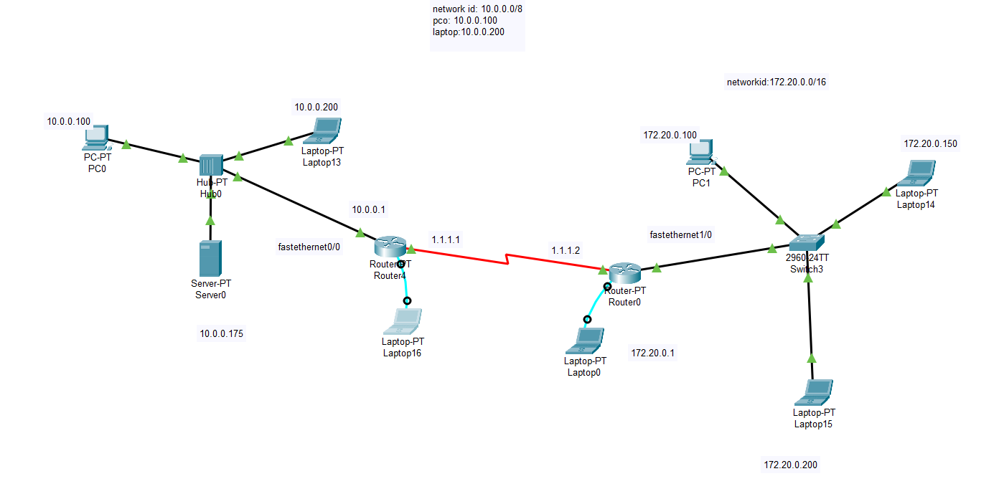
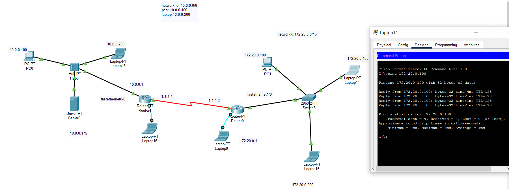

# Network Design Project (Cisco Packet Tracer)

## 📌 Overview
This project demonstrates the design and implementation of a multi-network topology using Cisco Packet Tracer.

## 🛠️ Features
- Configured two networks:
  - 10.0.0.0/8
  - 172.20.0.0/16
- Implemented static routing between routers
- Connected devices using switches and hubs
- Assigned IP addresses to PCs, laptops, and server
- Verified connectivity using ping (ICMP)

## 🌐 Topology

## 📡 Ping Test

## 📂 Files
- Varun_network_design.pkt

## 🚀 Tools Used
- Cisco Packet Tracer
